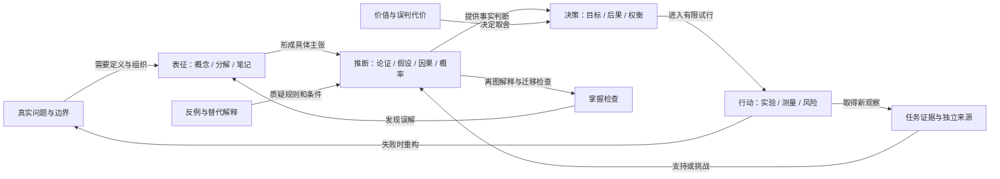

# 结构化思维资料与可编辑网状框架

收集与改编日期：2026-10-03。目标：在 Project Graph 中围绕真实问题，检查自己的定义、材料、推理、价值取舍和行动结果。资料集合不是系统综述；方法框架不是已验证的推理引擎。

论文原文已统一迁入[全库论文目录](../papers/README.md)，完整书籍 / 草稿见[书籍文件](../books/README.md)；本专题保留研究解释、方法框架和案例。

## 已交付的内容

- [33 本分类书目](books.md)：英文原名、作者、版本、来源、可提取结构；未宣称通读。
- [论文与证据索引](papers.md)：18 条研究文献记录，17 份本地可读；其中 15 份新下载、2 份复用旧资料。另存 2 份公开书籍 / 草稿。
- [20 个方法框架](frameworks.md)：347 个语义节点、355 条明确关系，含适用条件、操作协议、自检、反例与修订路径。
- [完整落地案例](worked-examples.md)：一个围绕当前目标的填图案例，以及一个用假设数字检查基准率误判的案例。
- [机器可读蓝图](frameworks.json)、[体系 / 总框架 / 案例蓝图](supplemental-graphs.json)、[原生图清单](maps-manifest.json)、[来源档案](sources.json)。

20 个方法文件加 3 个总览 / 案例文件，共 **23 个 `.prg` 原生文件**。它们是资料交付，不代表新增软件功能。所有原生文件由 Godot MCP 调用项目现有保存接口生成。初次交付的属性编码错误导致打开空白，现已[修复 23 个文件及桌面副本](prg-repair.md)，重新写入返回成功；尚未在运行中的 Project Graph 打开或验证显示、交互、保存重开和撤销。

## 桌面交付位置

23 个原生文件同时放在 `/home/waya/Desktop/project`，采用“结构化思维-ID-中文方法名.prg”命名，附 `结构化思维-使用说明.md`。初次交付不覆盖目标目录已有文件；本次空白修复备份后替换对应的 23 个交付文件；实际路径记录在 `maps-manifest.json` 的 `desktop_file`。仓库 maps 保留研究快照；桌面编辑不自动同步到研究蓝图。

## 先打开这三张图

| 文件 | 用途 |
| --- | --- |
| [方法体系总图](maps/00-method-atlas.prg) | 理解方法之间的进入条件；不是把方法名称并列成目录 |
| [个人思考自检总框架](maps/01-personal-audit-loop.prg) | 围绕当前问题检查资料、保证、反例、价值和更新 |
| [完整案例：检验网状图是否有用](maps/02-worked-example-thinking-audit.prg) | 看一个完整填写案例如何把文献边界、异议和试行连起来 |

## 体系怎样运转

表征处理“我讨论什么”，推断处理“材料凭什么推出结论”，决策处理“什么结果值得选择”，行动处理“现实结果怎样改变认识”。补充方法帮助产生候选或切换视角。一次使用选一个主框架，再选一个最能挑战它的审查框架，**最多保持两个并行思考方向**。五种节点角色只是内容分类，不是要求五路并行。

这张总图和各方法中的节点 / 边均为项目改编。原概念图、论证结构、因果 DAG 与反馈回路有各自语义，不能仅因都长得像网而混用。

## 关系的语义约定

| 关系 | 画出来之前要说明什么 | 常见错误 |
| --- | --- | --- |
| 支持 / 推出 | 资料、保证、限定条件；多前提联合成立时建立“联合理由”节点 | 多条弱支持线被当作逻辑必然 |
| 反驳 / 挑战 | 它挑战哪项资料、保证、条件或价值，而不是只接总标题 | 把不同意见都叫反例 |
| 因果作用 | 方向、时间、机制及遗漏假设 | 相关性直接变成因果 |
| 反馈 | 回路、存量 / 流量、影响极性与延迟 | +/− 当成好 / 坏；静态 DAG 画环 |
| 触发 / 依赖 | 哪个可观测条件触发什么行动；必要条件与充分条件分开 | 用空间位置代替顺序 |
| 修订 | 旧判断、新判断、改变原因与剩余未知 | 擦掉事前判断，再说自己一直正确 |

自然语言边不自动执行逻辑运算。若两个前提必须共同成立，应把它们接到明确的联合理由节点再推出结论；若任一个理由就足够，分别标明独立支持。未经辨别，不能仅用箭头数量判断论证强度。

方法来源节点只说明方法由来，**不作为本次任务的结论证据**。原生图目前把提示、条件和来源编号写在普通文本节点中，没有冒充尚待实现的专用证据库、自动校准或推理检查功能。

## 20 张方法图

| ID | 框架 | 原生文件 | 主语义节点 / 关系 |
| --- | --- | --- | --- |
| M01 | 概念图：检验我是否理解关系 | [打开 / 下载](maps/m01-concept-map.prg) | 17 / 17 |
| M02 | 问题分解：部分如何共同解释整体 | [打开 / 下载](maps/m02-problem-decomposition.prg) | 18 / 21 |
| M03 | 金字塔：把结论与理由逐层对齐 | [打开 / 下载](maps/m03-pyramid.prg) | 18 / 18 |
| M04 | 命题笔记：让知识连接产生新问题 | [打开 / 下载](maps/m04-linked-notes.prg) | 17 / 17 |
| M05 | 论证网：资料凭什么支持主张 | [打开 / 下载](maps/m05-toulmin.prg) | 17 / 18 |
| M06 | 批判审查：对自己和反方使用同一标准 | [打开 / 下载](maps/m06-critical-review.prg) | 17 / 16 |
| M07 | 竞争假设：主动寻找能排除解释的证据 | [打开 / 下载](maps/m07-competing-hypotheses.prg) | 18 / 19 |
| M08 | 因果图：区分观察关系与干预结果 | [打开 / 下载](maps/m08-causal.prg) | 17 / 17 |
| M09 | 概率更新：证据到底改变了多少信念 | [打开 / 下载](maps/m09-bayesian.prg) | 17 / 17 |
| M10 | 结构类比：迁移关系，同时标明失效点 | [打开 / 下载](maps/m10-analogy.prg) | 17 / 16 |
| M11 | 价值决策：从目标创造选择，再比较后果 | [打开 / 下载](maps/m11-value-decision.prg) | 18 / 19 |
| M12 | 预测与校准：事前可判，事后可学 | [打开 / 下载](maps/m12-forecast-calibration.prg) | 17 / 17 |
| M13 | 系统反馈：从事件追到积累与回路 | [打开 / 下载](maps/m13-system-feedback.prg) | 18 / 19 |
| M14 | 问题重构：分开事实争议与世界观冲突 | [打开 / 下载](maps/m14-problem-reframing.prg) | 17 / 17 |
| M15 | 设计实验：从真实需要走到可推翻的原型 | [打开 / 下载](maps/m15-design-experiment.prg) | 18 / 19 |
| M16 | 事前风险与复盘：把失败路径接到行动 | [打开 / 下载](maps/m16-premortem.prg) | 17 / 19 |
| M17 | 测量与估算：把模糊判断变成可比较信息 | [打开 / 下载](maps/m17-measurement-estimation.prg) | 18 / 17 |
| M18 | 自我解释与迁移：检验我会用而非只会认 | [打开 / 下载](maps/m18-self-explanation.prg) | 17 / 18 |
| M19 | TRIZ：把取舍写成矛盾，再生成可检验候选 | [打开 / 下载](maps/m19-triz.prg) | 17 / 18 |
| M20 | 六帽视角：分开信息类型，最后汇合审查 | [打开 / 下载](maps/m20-six-hats.prg) | 17 / 16 |

数字不包含用于定位的标题和角色标题节点。图中文字是填图提示，可直接改成具体内容。颜色区分界定、材料、推理、质疑和行动；连线关系文字提供语义，颜色和布局不代替证据。初始视野为总览，阅读时需要放大并移动。

## 一次实际使用

1. 选一个尚未定论的具体问题，打开对应方法图并**另存为工作副本**。
2. 先替换问题、材料和暂定主张；保留不能回答的节点为“未知”，不要为了填满而编造。
3. 对关键边写解释与条件，将至少一个合理异议接到它实际挑战的对象。
4. 选一个审查框架检查主图的最大缺口。新增连接必须说明为什么改变理解。
5. 写下一步取证 / 行动、负责人、停止条件与复审信号。
6. 保存事前版本，再记录结果及判断改变。离开图解释关键关系；有需要时用新任务检查迁移。

不用一次填完 20 个框架，也不用在一张画布里堆满全部书名。材料跨图流转时，转移具体问题、命题或待检验条件，避免只把两个方法标题相连。

## 由用户执行的手动验证（尚未执行）

| 步骤 | 应观察到的结果 | 失败时重点检查 |
| --- | --- | --- |
| 打开 `maps/01-personal-audit-loop.prg`；放大观察 | 中文问题节点、有向关系和关系文字；关键关系可追踪 | 文件是否完整、节点 / 边是否缺失、缩放是否只看到了局部 |
| 打开 `maps/m05-toulmin.prg`，双击节点改为真实主张 | 可编辑内容；资料、保证、例外和异议分别存在 | 是否只修改了标题，没有明确保证；文本是否遮挡 |
| 移动“论证保证”节点 | 相连关系继续连到该节点，方向与文字可辨识 | 连线是否错端、标签是否遮挡或丢失 |
| 将图另存为副本、关闭，再打开副本 | 文本、位置和带文字的关系保留 | 引用端点、标签、中文内容或颜色是否丢失 |
| 修改一项内容并执行撤销 / 重做 | 一次编辑可恢复，再重做得到修改结果 | 是否需要多次撤销、关系被意外改动或节点引用错乱 |
| 按案例 A 填一次真实问题，离图复述 | 能解释资料怎样支持主张、成立条件与改判信息 | 是资料不足、保证缺失、条件混淆还是只记住了词语 |

自动测试、构建、打开重载和视觉审查未执行，不能把保存接口成功写成上述验证通过。未启动 Godot 或项目；在已有编辑器连接中只做 MCP 源码读取和原生文件写入。

## 实际改动与工具

新增本资料目录、书目、文献档案、框架蓝图、原生图与案例；在 `docs/README.md` 增加入口。没有修改项目功能源码、场景、已有样例或第三方插件。

MCP 类别：`mcp__godot_mcp__read_script` 只读保存 / 序列化与节点属性；`mcp__godot_mcp__execute_editor_script` 调用既有 `ProjectFile.save` 写 23 个原生档案；编辑器日志只用于纠正一次生成脚本的返回类型错误。没有运行项目测试。普通文档通过文本工具维护，论文原文件通过公开地址下载，阅读使用 PDF 文本提取 / 首页图像。

复用项目已有序列化、Godot JSON / ZIP 与 Python 标准库，不新增依赖或通用解析器。原文保留版权 / 许可；本次没有对外发布。

## 当前证据空缺

- P15 概率心智模型 PDF、B27 Dewey 原版 PDF 下载受阻；保存失败记录与书目。
- R01 旧 PDF 地址失效，使用现有官方方法网页；不将图片冒充论文。
- 金字塔、六帽、卡片笔记、TRIZ 的完整使用流程在此集合中未分别取得直接效果试验支持，不能按“有论文”统称为普遍有效。
- 有关学习 / 教学的研究不能自动证明 Project Graph 有效；实际用户任务结果仍为空。
- 目前是有来源的框架资料与可编辑文件，视觉与交互体验仍需上述手动验证。
